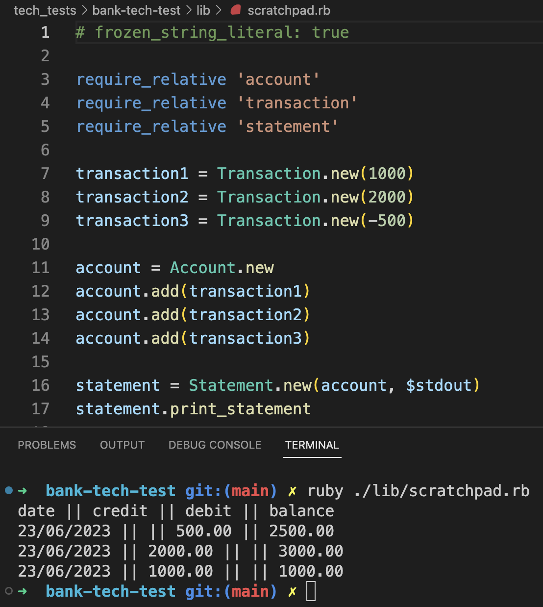

# Bank tech test

## Description

A tech test as part of Makers 'Code Quality' week.

### Specification: Requirements

* You should be able to interact with your code via a REPL like IRB or Node.  (You don't need to implement a command line interface that takes input from STDIN.)
* Deposits, withdrawal.
* Account statement (date, amount, balance) printing.
* Data can be kept in memory (it doesn't need to be stored to a database or anything).

### Specification: Acceptance criteria

**Given** a client makes a deposit of 1000 on 10-01-2023  
**And** a deposit of 2000 on 13-01-2023  
**And** a withdrawal of 500 on 14-01-2023  
**When** she prints her bank statement  
**Then** she would see

```shell
date || credit || debit || balance
14/01/2023 || || 500.00 || 2500.00
13/01/2023 || 2000.00 || || 3000.00
10/01/2023 || 1000.00 || || 1000.00
```

## How to use

Clone the repo, and navigate to the project directory.

### To install dependencies

Run:

```shell
bundle install
```

### To run the tests

Run:

```shell
rspec
```

You'll see that all tests are passing, with 100% test coverage. If you run `rubocop` you'll see that I have no RuboCop offences, _pace_ the configuration changes I have made in `.rubocop.yml` (mainly to exempt the spec files).

### To run the project

Open an `irb` session, requiring in the three Ruby files in `./lib`. Use instances of the classes, as in the below example, to see the program meeting the acceptance criteria:

```ruby
transaction1 = Transaction.new(1000, '10-01-2023')
transaction2 = Transaction.new(2000, '13-01-2023')
transaction3 = Transaction.new(-500, '14-01-2023')

account = Account.new
account.add(transaction1)
account.add(transaction2)
account.add(transaction3)

statement = Statement.new(account, $stdout)
statement.print_statement
```

A screenshot of this in action, using a scratch Ruby file rather than the REPL:


## My approach

First, I made some notes on the requirements and acceptability criteria, drawing out features such as the sorting of transactions by descending date order and the formatting of amounts.
In my design approach, I was keen to practice single-responsibility, and so early on I began working towards a three-class program design. I find I draft more fluidly on paper; here's a photo of my paper diagram, which as you can see went through several revisions as I designed upwards from the `Transaction` class and thought of some more elegant solutions:


Here's an Excalidraw diagram of the final design:


I made some decisions early on that affected the outward growth of the program. Of note:
- choosing to take the deposit/withdrawal acceptance criteria somewhat at face value, and that therefore a `Transaction` would take an amount and a date string as arguments
- having an `Account` that holds an array of `Transaction` instances
- `Account` performing balance calculations and updating its `Transaction`s accordingly

Areas for improvement:
- I am not convinced that `Account#calculate_balances` is the best solution, since it modifies instance variables rather than returning something
- While I like the flexibility that the current `Transaction` date solution offers, the 'strictness' of binding each new `Transaction` to a `Date.now` might be a better constraint on user behaviour (depending on the envisaged context)

Thanks for reading! I would welcome feedback.
